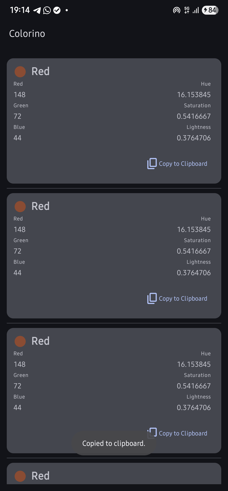
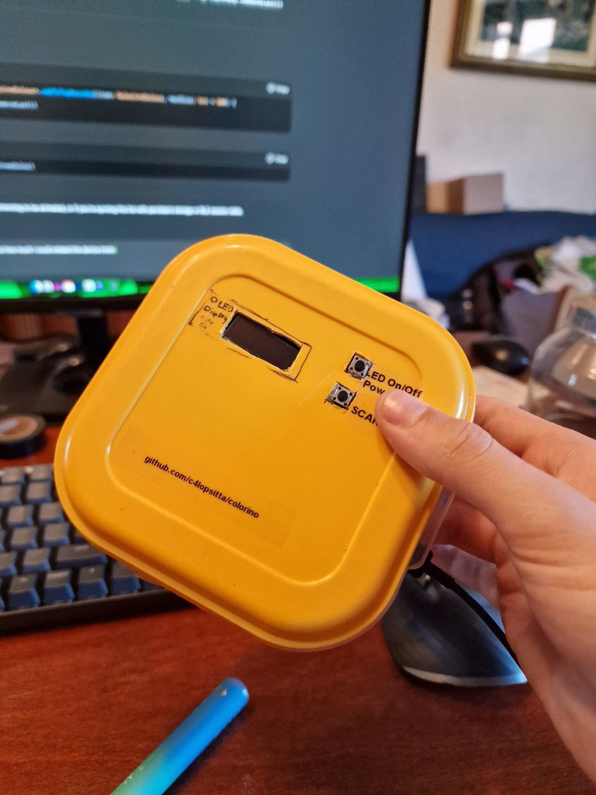
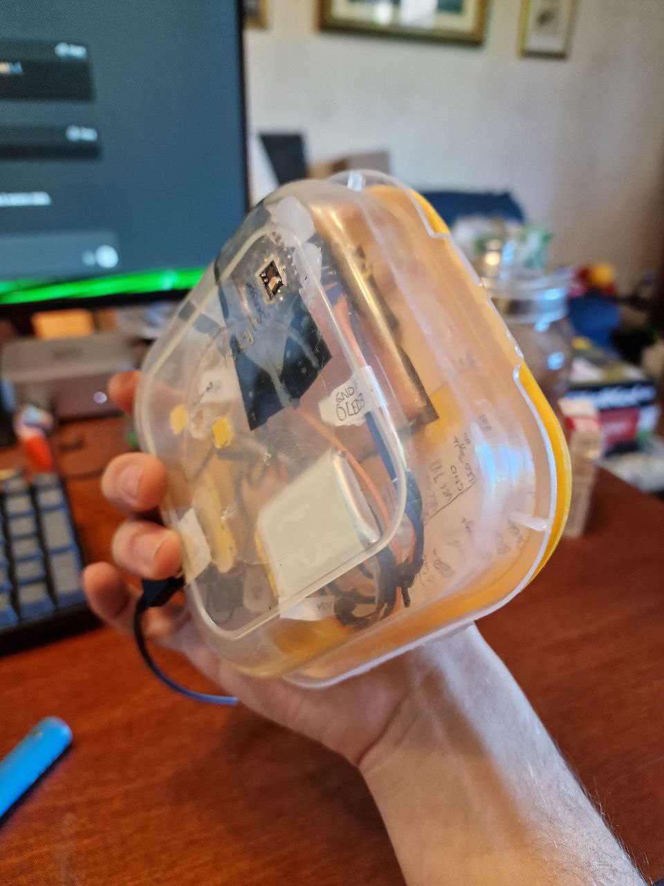

# Colorino
In this Repository there are stored the Android companion application and code for the ESP32 powering 
the device.

## Diagram

## Components
- Seeed Studio XIAO ESP32 S3
- 500mAh Li-Po Battery
- A pair of plain old buttons
- Many messy wires
- TCS34725 RGB Sensor
- 128x32 OLED Monochromatic display
- A simple tupperware container from the kitchen cut with a surgical scalpel heated with a plain old lighter

## App Screenshots

## Technologies Used
- Kotlin
- Jetpack Compose
- Bluetooth LE
- Arduino/ESP32 IDE with C++ code

## Notes
This project has been created as a gift for a friend, support will be sparse but feel free to fork 
and have fun with the project. The project is entirely (from the ESP32 to the Android app's code) 
licensed under the GPLv3 License, as it can be seen in the [COPYING](COPYING) file. 

The Bluetooth LE implementation goes against any standard, using a non-registered vendor code, as i 
unfortunately don't have one. There's no pairing or encryption, your scanned colors will be broadcasted 
to anyone and anything around you that is listening, as I have used plain old advertising packets 
for communication for simplicity reasons.

The TCS34725 RGB Sensor is quite inaccurate from my testing, often reporting darker colours or heavily
averaging the colors into grays and blacks, i'd suggest, if you try to copy the project yourself, to 
try another sensor, and inform yourself better than i did. I hope this will be useful for someone out 
there in some kind of way, it's surprising how much you can do with an afternoon of soldering and coding. 

## Device images

